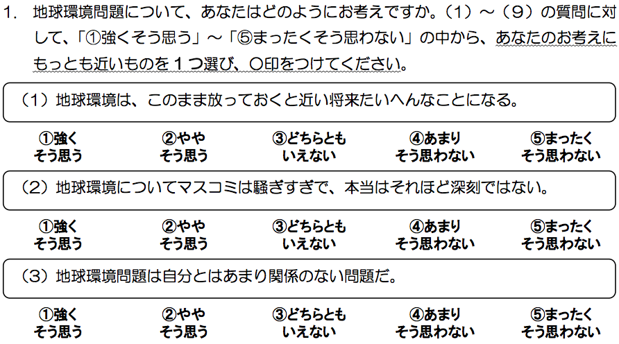
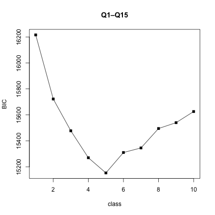
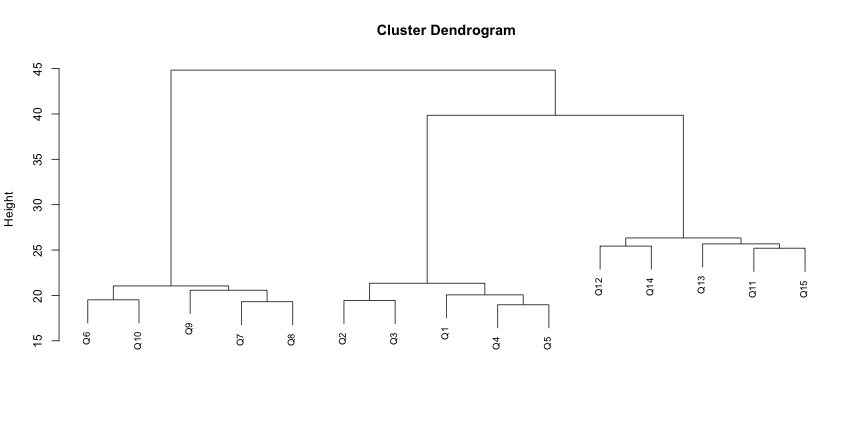
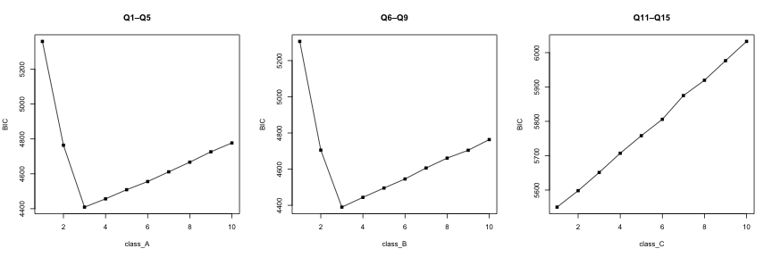
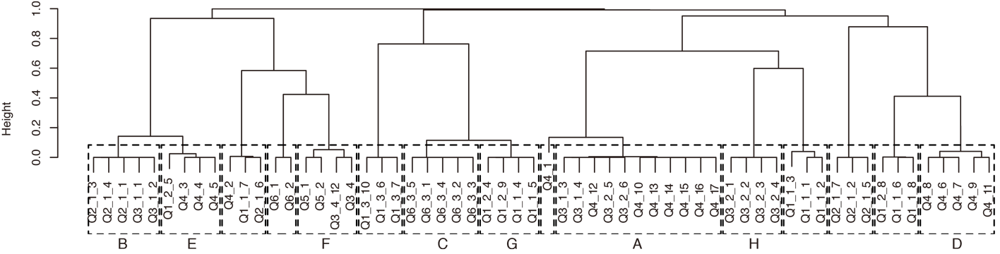

<style type="text/css">
body {
  font-family: "Hiragino Kaku Gothic ProN", Meiryo;
  background: #303030; /*grey transparent;*/
}

p {
  font-size: 20px !important;
  color: #222 !important;
}

ul {
  font-size: 30px !important;
  color: #222 !important;
}

h2 {
  font-size: 30px !important;
  color: #aa0000; /*!important;*/
}

table {
  font-size: 35px !important;
}

blockquote {
  background-color: #f2f2f2 !important;
}

strong {
  color: #0000aa !important;
}

blue {
  color: #0000CC;
  font-weight: bold;
}

.rmdtable {
  color: #222 !important;
}

.big {
  font-size: 40px !important;
}

.small {
  font-size: 20px !important;
}

aside.gdbar img {
  width: 75px; 
  height: 75px; 
  position: absolute;
  right: 0;
  margin: 8px 15px;
}

.title-slide {
  background-color: white;
}

.title-slide h1 {
  font-size: 36px !important;
}

.title-slide hgroup > h1, 
.title-slide hgroup > h2 {
  color: #222 ;  /* ; #ef5150*/
}

.segue h1 {
  font-weight: 600;
  font-size: 45px !important;
  line-height: 45px !important;
  letter-spacing: -2px !important;
  color: #fff !important;
}

.title-slide hgroup h1 {
  font-size: 65px;
  line-height: 1.4;
  letter-spacing: -3px;
  color: #515151 !important;
}

.ronten iframe {
  width: 100%;
  height: 300px;
  background: white;
  border: 0;
  -webkit-box-sizing: border-box;
  -moz-box-sizing: border-box;
  box-sizing: border-box;
}

code.r {
  font-size: 15px !important;
  background-color: #f8f8f8;
}

code {
  font-size: 15px !important;
  color: #222 !important;
}
</style>

<!-- Styles for R syntax highlighter -->
<style type="text/css">
pre .operator,
pre .paren {
  color: #222 !important;
}

pre .literal {
  color: #222 !important;
}

pre .number {
  color: #222 !important;
}

pre .comment {
  color: #222 !important;
}

pre .keyword {
  color: #222 !important;
}

pre .identifier {
  color: #222 !important;
}

pre .string {
  color: #222 !important;
}

.tomorrow-orange, pre .preprocessor {
  color: darkred !important;
}
</style>

## 消費者セグメンテーション

- 消費者を分類すること
- 一昔前までは，デモグラフィック変数（年齢，性別，家族構成，家庭のライフサイクル，所得水準，職業，学歴，宗教，人種，国籍など）により，消費者を分類していた

## そもそも，なぜセグメンテーションするのか

- **○○する人**を増やすにはどうすればよいか？
- 全員にプロモーションするのは非効率
- 「**○○する人**は**××である人**だ」という関係を見つける
- 全体の一部である**××である人**にプロモーションすると効果的
  + このとき，**××である人**を**××ではない人**どうやって区別するのか？
  + これを実現する手法がセグメンテーション

---

## 消費者セグメンテーションの難しさ

- 消費者の選好が多様化するにつれて，デモグラフィック変数だけでは消費者を分類できなくなってきた
- 意識と行動レベルでの消費者の分類が必要
  + アンケート調査が主要な方法となる
  + 回答が言い回し（wording）に影響されやすいことから，ひとつの情報を得るために同様の質問を繰り返す

---

## 例えば，地球環境問題に対する危機意識を知りたい場合

<div style="text-align: center;"></div>

- こう聞けばよいという聞き方はないため，調査実施者が工夫して調査票を設計し，回答者の考えを引き出す必要がある

---

## 消費者意識と行動に関するアンケート調査

- 消費者意識と行動に関するアンケート調査の特性
  + 意識と行動に関する多数の質問が必要
  + 同様の質問を重ねて問うことも必要

- 消費者意識と行動に関するアンケート調査結果のデータ特性
  + 回答パターンが何種類か存在
  + 特定のパターンをとらない回答者・質問も混在
  + うまく消費者意識をとらえた質問とそうでない質問が混在
  + **分析手法を誤るとセグメンテーションに失敗する**

---

## 分析手法の検討

- アンケート調査結果には以下のような傾向が存在すると仮定
    1. 回答にはいくつかのパターンが存在する
    2. 回答パターンは質問に対して部分的である
    3. 質問によっては，任意の回答パターンをとる消費者ととらない消費者が存在する
    4. すべての質問にわたって回答パターンをとらない消費者が存在する
- この仮定に従って，回答パターンが部分的に存在するデータを人為的に生成
  + 質問=変数=15
  + 各問の選択肢={1, 2, 3}
  + 回答者=500

---

## 人為的にデータセットを生成

- 2質問群×2タイプの回答パターンが存在
    1. 問1–問5に回答パターン
      + 回答者1–100は，すべて1 **＜パターン1-1＞**
      + 回答者101–200は，すべて3 **＜パターン1-2＞**
    2. 問6–問10に回答パターン
      + 回答者1–30，181–250は，すべて1 **＜パターン2-1＞**
      + 回答者81–130と251–300は，すべて3 **＜パターン2-2＞**
    3. その他は回答パターンなし

→パターンなしを含めると，全部で**9パターン**


---

## 人為的に生成したデータセット

<div style="text-align: right;margin: 0 170px 0 0;"></div>

---

## 2質問群×2タイプの回答パターン

<div style="text-align: right;margin: 0 170px 0 0;"></div>

---

## 2質問群×2タイプの回答パターン

<div style="text-align: center;"></div>

---

## 購買意志の強い消費者層

- 1つの回答パターンの消費者だけの購買意志が強い場合：**ケース1**

<div style="text-align: center;"></div>

---

## 購買意志の強い消費者層

- 2つの無関係な回答パターンの消費者の購買意志が強い場合：**ケース2**

<div style="text-align: center;margin: 32px 0 0 0;"></div>

- **購買意志を示す変数**には，**強い場合に確率0.9で1**を与え，**弱い場合に確率0.1で1**を与える

--- .segue bg:dimgray

# 既存モデル適用の問題点

---

## 回帰分析：ケース1

1. Q1–Q15を独立変数とした二項ロジット分析
2. AICに基づく変数選択


```r
d0y1[c(1:4, 81:84, 101:104, 181:184), ]
```

```
##     Q1 Q2 Q3 Q4 Q5 Q6 Q7 Q8 Q9 Q10 Q11 Q12 Q13 Q14 Q15 y
## 1    1  1  1  1  1  1  1  1  1   1   1   1   1   1   1 1
## 2    1  1  1  1  1  1  1  1  1   1   3   2   3   2   3 1
## 3    1  1  1  1  1  1  1  1  1   1   2   3   2   2   3 1
## 4    1  1  1  1  1  1  1  1  1   1   2   2   3   2   2 1
## 81   1  1  1  1  1  3  3  3  3   3   3   3   2   1   1 0
## 82   1  1  1  1  1  3  3  3  3   3   1   2   1   2   2 0
## 83   1  1  1  1  1  3  3  3  3   3   2   1   3   2   3 0
## 84   1  1  1  1  1  3  3  3  3   3   1   3   3   3   2 0
## 101  3  3  3  3  3  3  3  3  3   3   2   1   2   2   2 0
## 102  3  3  3  3  3  3  3  3  3   3   3   2   1   3   3 0
## 103  3  3  3  3  3  3  3  3  3   3   1   1   2   2   3 0
## 104  3  3  3  3  3  3  3  3  3   3   3   2   3   1   1 0
## 181  3  3  3  3  3  1  1  1  1   1   1   3   3   1   2 0
## 182  3  3  3  3  3  1  1  1  1   1   3   3   3   1   3 0
## 183  3  3  3  3  3  1  1  1  1   1   2   1   2   1   1 0
## 184  3  3  3  3  3  1  1  1  1   1   2   3   3   3   1 0
```

---


```
## 
## Call:
## glm(formula = y ~ Q1 + Q2 + Q3 + Q6 + Q7 + Q8 + Q10 + Q12, family = binomial(link = "logit"), 
##     data = d0y1)
## 
## Deviance Residuals: 
##     Min       1Q   Median       3Q      Max  
## -1.2772  -0.6409  -0.4499  -0.2611   2.7882  
## 
## Coefficients:
##             Estimate Std. Error z value Pr(>|z|)  
## (Intercept)   0.9574     0.5779   1.657   0.0976 .
## Q1           -0.4619     0.1831  -2.522   0.0117 *
## Q2           -0.2614     0.1809  -1.445   0.1485  
## Q3           -0.2556     0.1784  -1.433   0.1519  
## Q6           -0.3377     0.1807  -1.869   0.0616 .
## Q7           -0.3167     0.1864  -1.700   0.0892 .
## Q8           -0.3263     0.1803  -1.810   0.0703 .
## Q10           0.2675     0.1787   1.497   0.1343  
## Q12           0.2525     0.1538   1.642   0.1006  
## ---
## Signif. codes:  0 '***' 0.001 '**' 0.01 '*' 0.05 '.' 0.1 ' ' 1
## 
## (Dispersion parameter for binomial family taken to be 1)
## 
##     Null deviance: 452.70  on 499  degrees of freedom
## Residual deviance: 399.15  on 491  degrees of freedom
## AIC: 417.15
## 
## Number of Fisher Scoring iterations: 5
```

---

## 回帰分析：ケース2

1. Q1–Q15を独立変数とした二項ロジット分析
2. AICに基づく変数選択


```r
d0y2[c(1:4, 81:84, 101:104, 181:184), ]
```

```
##     Q1 Q2 Q3 Q4 Q5 Q6 Q7 Q8 Q9 Q10 Q11 Q12 Q13 Q14 Q15 y
## 1    1  1  1  1  1  1  1  1  1   1   1   1   1   1   1 1
## 2    1  1  1  1  1  1  1  1  1   1   3   2   3   2   3 1
## 3    1  1  1  1  1  1  1  1  1   1   2   3   2   2   3 1
## 4    1  1  1  1  1  1  1  1  1   1   2   2   3   2   2 1
## 81   1  1  1  1  1  3  3  3  3   3   3   3   2   1   1 0
## 82   1  1  1  1  1  3  3  3  3   3   1   2   1   2   2 1
## 83   1  1  1  1  1  3  3  3  3   3   2   1   3   2   3 0
## 84   1  1  1  1  1  3  3  3  3   3   1   3   3   3   2 0
## 101  3  3  3  3  3  3  3  3  3   3   2   1   2   2   2 1
## 102  3  3  3  3  3  3  3  3  3   3   3   2   1   3   3 1
## 103  3  3  3  3  3  3  3  3  3   3   1   1   2   2   3 1
## 104  3  3  3  3  3  3  3  3  3   3   3   2   3   1   1 1
## 181  3  3  3  3  3  1  1  1  1   1   1   3   3   1   2 0
## 182  3  3  3  3  3  1  1  1  1   1   3   3   3   1   3 0
## 183  3  3  3  3  3  1  1  1  1   1   2   1   2   1   1 0
## 184  3  3  3  3  3  1  1  1  1   1   2   3   3   3   1 0
```

---


```
## 
## Call:
## glm(formula = y ~ Q11, family = binomial(link = "logit"), data = d0y2)
## 
## Deviance Residuals: 
##     Min       1Q   Median       3Q      Max  
## -0.7200  -0.6338  -0.6338  -0.5561   1.9713  
## 
## Coefficients:
##             Estimate Std. Error z value Pr(>|z|)    
## (Intercept)  -2.0735     0.3237  -6.406 1.49e-10 ***
## Q11           0.2852     0.1434   1.989   0.0468 *  
## ---
## Signif. codes:  0 '***' 0.001 '**' 0.01 '*' 0.05 '.' 0.1 ' ' 1
## 
## (Dispersion parameter for binomial family taken to be 1)
## 
##     Null deviance: 477.4  on 499  degrees of freedom
## Residual deviance: 473.4  on 498  degrees of freedom
## AIC: 477.4
## 
## Number of Fisher Scoring iterations: 4
```

---

## 回帰分析の問題点

- 意味のある変数（のうちのいくつか）が選択される
- データが少し変わるだけで，選択される変数が変わる

---

## 因子分析

1. Q1–Q15で因子分析
2. 抽出した因子スコアで回帰分析

---


```
## 
## Loadings:
##     Factor1 Factor2
## Q1           0.707 
## Q2           0.693 
## Q3           0.689 
## Q4           0.721 
## Q5           0.700 
## Q6   0.715         
## Q7   0.744         
## Q8   0.694         
## Q9   0.680         
## Q10  0.701         
## Q11 -0.110         
## Q12                
## Q13                
## Q14                
## Q15                
## 
##                Factor1 Factor2
## SS loadings      2.542   2.480
## Proportion Var   0.169   0.165
## Cumulative Var   0.169   0.335
```

---


```
## 
## Loadings:
##     Factor1 Factor2 Factor3
## Q1   0.771           0.631 
## Q2   0.695                 
## Q3   0.681                 
## Q4   0.713                 
## Q5   0.710          -0.111 
## Q6           0.713         
## Q7           0.743         
## Q8           0.690         
## Q9           0.676         
## Q10          0.698         
## Q11         -0.114         
## Q12                        
## Q13                        
## Q14                  0.154 
## Q15                  0.102 
## 
##                Factor1 Factor2 Factor3
## SS loadings      2.569   2.518   0.488
## Proportion Var   0.171   0.168   0.033
## Cumulative Var   0.171   0.339   0.372
```

---


```
## 
## Loadings:
##     Factor1 Factor2 Factor3 Factor4 Factor5 Factor6 Factor7
## Q1   0.771           0.582           0.237                 
## Q2   0.659                          -0.214                 
## Q3   0.665           0.120   0.160  -0.333  -0.218         
## Q4   0.681                                  -0.121         
## Q5   0.860          -0.370  -0.240           0.136         
## Q6           0.710                                  -0.104 
## Q7           0.725  -0.119   0.582   0.276   0.178         
## Q8           0.668                                         
## Q9           0.679                                   0.148 
## Q10          0.741                                         
## Q11                                                        
## Q12                                          0.361         
## Q13                                  0.187                 
## Q14                  0.197                   0.102         
## Q15                                                  0.364 
## 
##                Factor1 Factor2 Factor3 Factor4 Factor5 Factor6 Factor7
## SS loadings      2.690   2.513   0.565   0.458   0.344   0.273   0.205
## Proportion Var   0.179   0.168   0.038   0.031   0.023   0.018   0.014
## Cumulative Var   0.179   0.347   0.385   0.415   0.438   0.456   0.470
```

---

## 因子分析：ケース1

1. 2因子を使った二項ロジット分析
2. AICに基づく変数選択


```r
d0y1s[c(1:4, 81:84, 101:104, 181:184), ]
```

```
##     Q1 Q2 Q3 Q4 Q5 Q6 Q7 Q8 Q9 Q10 Q11 Q12 Q13 Q14 Q15 y   Factor1
## 1    1  1  1  1  1  1  1  1  1   1   1   1   1   1   1 1 -1.561722
## 2    1  1  1  1  1  1  1  1  1   1   3   2   3   2   3 1 -1.608148
## 3    1  1  1  1  1  1  1  1  1   1   2   3   2   2   3 1 -1.575890
## 4    1  1  1  1  1  1  1  1  1   1   2   2   3   2   2 1 -1.568160
## 81   1  1  1  1  1  3  3  3  3   3   3   3   2   1   1 0  1.534196
## 82   1  1  1  1  1  3  3  3  3   3   1   2   1   2   2 0  1.565342
## 83   1  1  1  1  1  3  3  3  3   3   2   1   3   2   3 0  1.525630
## 84   1  1  1  1  1  3  3  3  3   3   1   3   3   3   2 0  1.598890
## 101  3  3  3  3  3  3  3  3  3   3   2   1   2   2   2 0  1.560087
## 102  3  3  3  3  3  3  3  3  3   3   3   2   1   3   3 0  1.535479
## 103  3  3  3  3  3  3  3  3  3   3   1   1   2   2   3 0  1.573053
## 104  3  3  3  3  3  3  3  3  3   3   3   2   3   1   1 0  1.555418
## 181  3  3  3  3  3  1  1  1  1   1   1   3   3   1   2 0 -1.512441
## 182  3  3  3  3  3  1  1  1  1   1   3   3   3   1   3 0 -1.578905
## 183  3  3  3  3  3  1  1  1  1   1   2   1   2   1   1 0 -1.555139
## 184  3  3  3  3  3  1  1  1  1   1   2   3   3   3   1 0 -1.506211
##       Factor2
## 1   -1.413705
## 2   -1.452639
## 3   -1.448299
## 4   -1.451135
## 81  -1.749993
## 82  -1.701813
## 83  -1.719437
## 84  -1.737740
## 101  1.473881
## 102  1.482407
## 103  1.479455
## 104  1.429240
## 181  1.708690
## 182  1.703647
## 183  1.747471
## 184  1.721575
```

---


```
## 
## Call:
## glm(formula = y ~ Q12 + Factor1 + Factor2, family = binomial(link = "logit"), 
##     data = d0y1s)
## 
## Deviance Residuals: 
##     Min       1Q   Median       3Q      Max  
## -1.1183  -0.6337  -0.4622  -0.2966   2.7809  
## 
## Coefficients:
##             Estimate Std. Error z value Pr(>|z|)    
## (Intercept)  -2.2988     0.3552  -6.473 9.64e-11 ***
## Q12           0.2168     0.1516   1.430    0.153    
## Factor1      -0.5205     0.1223  -4.257 2.07e-05 ***
## Factor2      -0.6423     0.1259  -5.101 3.39e-07 ***
## ---
## Signif. codes:  0 '***' 0.001 '**' 0.01 '*' 0.05 '.' 0.1 ' ' 1
## 
## (Dispersion parameter for binomial family taken to be 1)
## 
##     Null deviance: 452.70  on 499  degrees of freedom
## Residual deviance: 403.39  on 496  degrees of freedom
## AIC: 411.39
## 
## Number of Fisher Scoring iterations: 5
```

---

## 因子分析：ケース2

1. 2因子を使った二項ロジット分析
2. AICに基づく変数選択


```r
d0y2s[c(1:4, 81:84, 101:104, 181:184), ]
```

```
##     Q1 Q2 Q3 Q4 Q5 Q6 Q7 Q8 Q9 Q10 Q11 Q12 Q13 Q14 Q15 y   Factor1
## 1    1  1  1  1  1  1  1  1  1   1   1   1   1   1   1 1 -1.561722
## 2    1  1  1  1  1  1  1  1  1   1   3   2   3   2   3 1 -1.608148
## 3    1  1  1  1  1  1  1  1  1   1   2   3   2   2   3 1 -1.575890
## 4    1  1  1  1  1  1  1  1  1   1   2   2   3   2   2 1 -1.568160
## 81   1  1  1  1  1  3  3  3  3   3   3   3   2   1   1 0  1.534196
## 82   1  1  1  1  1  3  3  3  3   3   1   2   1   2   2 1  1.565342
## 83   1  1  1  1  1  3  3  3  3   3   2   1   3   2   3 0  1.525630
## 84   1  1  1  1  1  3  3  3  3   3   1   3   3   3   2 0  1.598890
## 101  3  3  3  3  3  3  3  3  3   3   2   1   2   2   2 1  1.560087
## 102  3  3  3  3  3  3  3  3  3   3   3   2   1   3   3 1  1.535479
## 103  3  3  3  3  3  3  3  3  3   3   1   1   2   2   3 1  1.573053
## 104  3  3  3  3  3  3  3  3  3   3   3   2   3   1   1 1  1.555418
## 181  3  3  3  3  3  1  1  1  1   1   1   3   3   1   2 0 -1.512441
## 182  3  3  3  3  3  1  1  1  1   1   3   3   3   1   3 0 -1.578905
## 183  3  3  3  3  3  1  1  1  1   1   2   1   2   1   1 0 -1.555139
## 184  3  3  3  3  3  1  1  1  1   1   2   3   3   3   1 0 -1.506211
##       Factor2
## 1   -1.413705
## 2   -1.452639
## 3   -1.448299
## 4   -1.451135
## 81  -1.749993
## 82  -1.701813
## 83  -1.719437
## 84  -1.737740
## 101  1.473881
## 102  1.482407
## 103  1.479455
## 104  1.429240
## 181  1.708690
## 182  1.703647
## 183  1.747471
## 184  1.721575
```

---


```
## 
## Call:
## glm(formula = y ~ Q11, family = binomial(link = "logit"), data = d0y2s)
## 
## Deviance Residuals: 
##     Min       1Q   Median       3Q      Max  
## -0.7200  -0.6338  -0.6338  -0.5561   1.9713  
## 
## Coefficients:
##             Estimate Std. Error z value Pr(>|z|)    
## (Intercept)  -2.0735     0.3237  -6.406 1.49e-10 ***
## Q11           0.2852     0.1434   1.989   0.0468 *  
## ---
## Signif. codes:  0 '***' 0.001 '**' 0.01 '*' 0.05 '.' 0.1 ' ' 1
## 
## (Dispersion parameter for binomial family taken to be 1)
## 
##     Null deviance: 477.4  on 499  degrees of freedom
## Residual deviance: 473.4  on 498  degrees of freedom
## AIC: 477.4
## 
## Number of Fisher Scoring iterations: 4
```

---

## 因子分析の問題点

- 累積寄与率が低い
- 2つの因子の選択に失敗することがある

---

## 潜在クラスモデル

- データから事後的にグループ分けを行う方法であり，マーケティングの分野では消費者セグメンテーションの方法として使われる

1. Q1–Q15に潜在クラスモデルを適用
2. BICに基づきクラス数決定

---



- クラス数5でBICが最小

---

## 潜在クラスモデルによる消費者セグメンテーション

<div style="text-align: center;"></div>

---

## 潜在クラスモデル：ケース1

1. 潜在クラスを使った二項ロジット分析
2. AICに基づく変数選択


```r
d0y1c[c(1:4, 81:84, 101:104, 181:184), ]
```

```
##     Q1 Q2 Q3 Q4 Q5 Q6 Q7 Q8 Q9 Q10 Q11 Q12 Q13 Q14 Q15 y class
## 1    1  1  1  1  1  1  1  1  1   1   1   1   1   1   1 1     3
## 2    1  1  1  1  1  1  1  1  1   1   3   2   3   2   3 1     3
## 3    1  1  1  1  1  1  1  1  1   1   2   3   2   2   3 1     3
## 4    1  1  1  1  1  1  1  1  1   1   2   2   3   2   2 1     3
## 81   1  1  1  1  1  3  3  3  3   3   3   3   2   1   1 0     2
## 82   1  1  1  1  1  3  3  3  3   3   1   2   1   2   2 0     2
## 83   1  1  1  1  1  3  3  3  3   3   2   1   3   2   3 0     2
## 84   1  1  1  1  1  3  3  3  3   3   1   3   3   3   2 0     2
## 101  3  3  3  3  3  3  3  3  3   3   2   1   2   2   2 0     4
## 102  3  3  3  3  3  3  3  3  3   3   3   2   1   3   3 0     4
## 103  3  3  3  3  3  3  3  3  3   3   1   1   2   2   3 0     4
## 104  3  3  3  3  3  3  3  3  3   3   3   2   3   1   1 0     4
## 181  3  3  3  3  3  1  1  1  1   1   1   3   3   1   2 0     5
## 182  3  3  3  3  3  1  1  1  1   1   3   3   3   1   3 0     5
## 183  3  3  3  3  3  1  1  1  1   1   2   1   2   1   1 0     5
## 184  3  3  3  3  3  1  1  1  1   1   2   3   3   3   1 0     5
```

---


```
## 
## Call:
## glm(formula = y ~ class, family = binomial(link = "logit"), data = d0y1c)
## 
## Deviance Residuals: 
##     Min       1Q   Median       3Q      Max  
## -0.9914  -0.5946  -0.5021  -0.3879   2.2911  
## 
## Coefficients:
##             Estimate Std. Error z value Pr(>|z|)    
## (Intercept)  -1.6433     0.2029  -8.101 5.45e-16 ***
## class2       -0.3641     0.4089  -0.891   0.3732    
## class3        1.1886     0.3011   3.947 7.91e-05 ***
## class4       -0.6961     0.4221  -1.649   0.0992 .  
## class5       -0.9061     0.5067  -1.788   0.0738 .  
## ---
## Signif. codes:  0 '***' 0.001 '**' 0.01 '*' 0.05 '.' 0.1 ' ' 1
## 
## (Dispersion parameter for binomial family taken to be 1)
## 
##     Null deviance: 452.70  on 499  degrees of freedom
## Residual deviance: 417.49  on 495  degrees of freedom
## AIC: 427.49
## 
## Number of Fisher Scoring iterations: 5
```

---

## 潜在クラスモデル：ケース2

1. 潜在クラスを使った二項ロジット分析
2. AICに基づく変数選択


```r
d0y2c[c(1:4, 81:84, 101:104, 181:184), ]
```

```
##     Q1 Q2 Q3 Q4 Q5 Q6 Q7 Q8 Q9 Q10 Q11 Q12 Q13 Q14 Q15 y class
## 1    1  1  1  1  1  1  1  1  1   1   1   1   1   1   1 1     3
## 2    1  1  1  1  1  1  1  1  1   1   3   2   3   2   3 1     3
## 3    1  1  1  1  1  1  1  1  1   1   2   3   2   2   3 1     3
## 4    1  1  1  1  1  1  1  1  1   1   2   2   3   2   2 1     3
## 81   1  1  1  1  1  3  3  3  3   3   3   3   2   1   1 0     2
## 82   1  1  1  1  1  3  3  3  3   3   1   2   1   2   2 1     2
## 83   1  1  1  1  1  3  3  3  3   3   2   1   3   2   3 0     2
## 84   1  1  1  1  1  3  3  3  3   3   1   3   3   3   2 0     2
## 101  3  3  3  3  3  3  3  3  3   3   2   1   2   2   2 1     4
## 102  3  3  3  3  3  3  3  3  3   3   3   2   1   3   3 1     4
## 103  3  3  3  3  3  3  3  3  3   3   1   1   2   2   3 1     4
## 104  3  3  3  3  3  3  3  3  3   3   3   2   3   1   1 1     4
## 181  3  3  3  3  3  1  1  1  1   1   1   3   3   1   2 0     5
## 182  3  3  3  3  3  1  1  1  1   1   3   3   3   1   3 0     5
## 183  3  3  3  3  3  1  1  1  1   1   2   1   2   1   1 0     5
## 184  3  3  3  3  3  1  1  1  1   1   2   3   3   3   1 0     5
```

---


```
## 
## Call:
## glm(formula = y ~ class, family = binomial(link = "logit"), data = d0y2c)
## 
## Deviance Residuals: 
##     Min       1Q   Median       3Q      Max  
## -0.9525  -0.4737  -0.4737  -0.4056   2.2534  
## 
## Coefficients:
##             Estimate Std. Error z value Pr(>|z|)    
## (Intercept)  -2.1307     0.2427  -8.781  < 2e-16 ***
## class2       -0.3260     0.4897  -0.666    0.506    
## class3        1.5757     0.3311   4.758 1.95e-06 ***
## class4        1.4211     0.3296   4.312 1.62e-05 ***
## class5       -0.2206     0.4913  -0.449    0.653    
## ---
## Signif. codes:  0 '***' 0.001 '**' 0.01 '*' 0.05 '.' 0.1 ' ' 1
## 
## (Dispersion parameter for binomial family taken to be 1)
## 
##     Null deviance: 477.4  on 499  degrees of freedom
## Residual deviance: 430.8  on 495  degrees of freedom
## AIC: 440.8
## 
## Number of Fisher Scoring iterations: 5
```

---

## 潜在クラスモデルの問題点

- 部分的に回答パターンが存在し，その他に回答パターンが存在しない場合，グループ分けが撹乱される
- グループ分けが不完全なため，解釈を誤るかもしれない

--- .segue bg:dimgray

# 潜在クラスモデルの限定的利用

---

## 潜在クラスモデルの限定的利用

1. 変数のクラスター分析で，関連の強い変数群に分類
2. 各変数群ごとに潜在クラスモデルを適用



---

## 潜在クラスモデル

1. Q1–Q5，Q6–Q10，Q11–Q15のそれぞれに潜在クラスモデルを適用
2. それぞれ，BICに基づきクラス数決定



- Q1–Q5は，クラス数3でBICが最小
- Q6–Q10は，クラス数3でBICが最小
- Q11–Q15は，クラス数1でBICが最小（クラス分けできない）

---

## 潜在クラスモデルの限定的利用

<div style="text-align: center;"></div>

---

## 潜在クラスモデルの限定的利用：ケース1

1. 潜在クラスを使った二項ロジット分析
2. AICに基づく変数選択


```r
d0y1cs[c(1:4, 81:84, 101:104, 181:184), ]
```

```
##     Q1 Q2 Q3 Q4 Q5 Q6 Q7 Q8 Q9 Q10 Q11 Q12 Q13 Q14 Q15 y class_A class_B
## 1    1  1  1  1  1  1  1  1  1   1   1   1   1   1   1 1       3       1
## 2    1  1  1  1  1  1  1  1  1   1   3   2   3   2   3 1       3       1
## 3    1  1  1  1  1  1  1  1  1   1   2   3   2   2   3 1       3       1
## 4    1  1  1  1  1  1  1  1  1   1   2   2   3   2   2 1       3       1
## 81   1  1  1  1  1  3  3  3  3   3   3   3   2   1   1 0       3       2
## 82   1  1  1  1  1  3  3  3  3   3   1   2   1   2   2 0       3       2
## 83   1  1  1  1  1  3  3  3  3   3   2   1   3   2   3 0       3       2
## 84   1  1  1  1  1  3  3  3  3   3   1   3   3   3   2 0       3       2
## 101  3  3  3  3  3  3  3  3  3   3   2   1   2   2   2 0       1       2
## 102  3  3  3  3  3  3  3  3  3   3   3   2   1   3   3 0       1       2
## 103  3  3  3  3  3  3  3  3  3   3   1   1   2   2   3 0       1       2
## 104  3  3  3  3  3  3  3  3  3   3   3   2   3   1   1 0       1       2
## 181  3  3  3  3  3  1  1  1  1   1   1   3   3   1   2 0       1       1
## 182  3  3  3  3  3  1  1  1  1   1   3   3   3   1   3 0       1       1
## 183  3  3  3  3  3  1  1  1  1   1   2   1   2   1   1 0       1       1
## 184  3  3  3  3  3  1  1  1  1   1   2   3   3   3   1 0       1       1
```

---


```
## 
## Call:
## glm(formula = y ~ Q12 + class_A:class_B, family = binomial(link = "logit"), 
##     data = d0y1cs)
## 
## Deviance Residuals: 
##     Min       1Q   Median       3Q      Max  
## -2.0737  -0.5470  -0.4647  -0.3143   2.6936  
## 
## Coefficients: (1 not defined because of singularities)
##                   Estimate Std. Error z value Pr(>|z|)    
## (Intercept)        -2.4418     0.5715  -4.273 1.93e-05 ***
## Q12                 0.3089     0.1702   1.815   0.0695 .  
## class_A1:class_B1 -15.6773   801.9428  -0.020   0.9844    
## class_A2:class_B1  -0.3939     0.6274  -0.628   0.5301    
## class_A3:class_B1   3.5415     0.6445   5.495 3.90e-08 ***
## class_A1:class_B2  -0.5057     0.7339  -0.689   0.4907    
## class_A2:class_B2  -0.3745     0.5972  -0.627   0.5306    
## class_A3:class_B2  -1.4678     1.1005  -1.334   0.1823    
## class_A1:class_B3  -0.6560     0.6652  -0.986   0.3241    
## class_A2:class_B3   0.2189     0.4574   0.479   0.6323    
## class_A3:class_B3       NA         NA      NA       NA    
## ---
## Signif. codes:  0 '***' 0.001 '**' 0.01 '*' 0.05 '.' 0.1 ' ' 1
## 
## (Dispersion parameter for binomial family taken to be 1)
## 
##     Null deviance: 452.70  on 499  degrees of freedom
## Residual deviance: 357.04  on 490  degrees of freedom
## AIC: 377.04
## 
## Number of Fisher Scoring iterations: 16
```

---

## 潜在クラスモデルの限定的利用：ケース2

1. 潜在クラスを使った二項ロジット分析
2. AICに基づく変数選択


```r
d0y2cs[c(1:4, 81:84, 101:104, 181:184), ]
```

```
##     Q1 Q2 Q3 Q4 Q5 Q6 Q7 Q8 Q9 Q10 Q11 Q12 Q13 Q14 Q15 y class_A class_B
## 1    1  1  1  1  1  1  1  1  1   1   1   1   1   1   1 1       3       1
## 2    1  1  1  1  1  1  1  1  1   1   3   2   3   2   3 1       3       1
## 3    1  1  1  1  1  1  1  1  1   1   2   3   2   2   3 1       3       1
## 4    1  1  1  1  1  1  1  1  1   1   2   2   3   2   2 1       3       1
## 81   1  1  1  1  1  3  3  3  3   3   3   3   2   1   1 0       3       2
## 82   1  1  1  1  1  3  3  3  3   3   1   2   1   2   2 1       3       2
## 83   1  1  1  1  1  3  3  3  3   3   2   1   3   2   3 0       3       2
## 84   1  1  1  1  1  3  3  3  3   3   1   3   3   3   2 0       3       2
## 101  3  3  3  3  3  3  3  3  3   3   2   1   2   2   2 1       1       2
## 102  3  3  3  3  3  3  3  3  3   3   3   2   1   3   3 1       1       2
## 103  3  3  3  3  3  3  3  3  3   3   1   1   2   2   3 1       1       2
## 104  3  3  3  3  3  3  3  3  3   3   3   2   3   1   1 1       1       2
## 181  3  3  3  3  3  1  1  1  1   1   1   3   3   1   2 0       1       1
## 182  3  3  3  3  3  1  1  1  1   1   3   3   3   1   3 0       1       1
## 183  3  3  3  3  3  1  1  1  1   1   2   1   2   1   1 0       1       1
## 184  3  3  3  3  3  1  1  1  1   1   2   3   3   3   1 0       1       1
```

---


```
## 
## Call:
## glm(formula = y ~ class_A:class_B, family = binomial(link = "logit"), 
##     data = d0y2cs)
## 
## Deviance Residuals: 
##     Min       1Q   Median       3Q      Max  
## -1.8626  -0.4710  -0.4218  -0.2649   2.5951  
## 
## Coefficients: (1 not defined because of singularities)
##                   Estimate Std. Error z value Pr(>|z|)    
## (Intercept)       -2.37491    0.52274  -4.543 5.54e-06 ***
## class_A1:class_B1 -0.02299    0.90483  -0.025    0.980    
## class_A2:class_B1  0.40547    0.68057   0.596    0.551    
## class_A3:class_B1  3.64787    0.67536   5.401 6.61e-08 ***
## class_A1:class_B2  3.91535    0.68966   5.677 1.37e-08 ***
## class_A2:class_B2 -0.95730    0.88945  -1.076    0.282    
## class_A3:class_B2 -0.11000    0.90273  -0.122    0.903    
## class_A1:class_B3 -0.04546    0.73856  -0.062    0.951    
## class_A2:class_B3  0.23175    0.57625   0.402    0.688    
## class_A3:class_B3       NA         NA      NA       NA    
## ---
## Signif. codes:  0 '***' 0.001 '**' 0.01 '*' 0.05 '.' 0.1 ' ' 1
## 
## (Dispersion parameter for binomial family taken to be 1)
## 
##     Null deviance: 477.40  on 499  degrees of freedom
## Residual deviance: 323.67  on 491  degrees of freedom
## AIC: 341.67
## 
## Number of Fisher Scoring iterations: 6
```

--- .segue bg:dimgray

# 実際のアンケート調査結果への適用

---

## アンケート調査の概要

- 調査目的
  + 生物多様性に配慮して生産された米に対する消費者意識と購買行動を調べる
- 調査方法
  + 郵送法
- 調査対象
  + 大津市と京都市の住宅地とみられる郵便番号を任意に選択し，同一郵便番号へ全戸配布（合計16地区）
- 調査期間
  + 2009年11月中旬配布　同年12月2日までに返送
- 配布部数：6,000部（大津市 4,710部　京都市 1,290部）
- 回収部数：1,189部（大津市 986部　京都市 177部　不明 26部）
- 回収率：19.8%

---

## 潜在クラスモデルの限定的利用

1. すべての質問間のクロス集計を行い，クロス集計表ごとにカイ二乗検定によるp値を得る
（ただし，この場合の無仮説は，各クロス集計表で定義されるすべてのオッズ比が0である）
2. 手順1で得たp値を質問間の距離行列として与え，質問に対する最長距離法によるクラスター分析を行う
3. クラスターの距離が小さい質問群をまとめて，その質問群のみを用いて潜在クラスモデルによる消費者の分類を行う
（ただし，クラス数はBICが最小となるものを採用する）

<div style="text-align: center;"></div>

---

## 質問群A：農村と食の安全性に対する意識と行動


<iframe src="./assets/widgets/data_enq_A1.html" width=100% height=100% allowtransparency="true"></iframe>


---


<iframe src="./assets/widgets/data_enq_A2.html" width=100% height=100% allowtransparency="true"></iframe>


---

## 質問群B：生き物や農山漁村などの自然環境に対する意識と行動

<iframe src="./assets/widgets/data_enq_B1.html" width=100% height=100% allowtransparency="true"></iframe>


---


<iframe src="./assets/widgets/data_enq_B2.html" width=100% height=100% allowtransparency="true"></iframe>


---

## 質問群C：魚のゆりかご水田米に対する評価

<iframe src="./assets/widgets/data_enq_C1.html" width=100% height=100% allowtransparency="true"></iframe>


---


<iframe src="./assets/widgets/data_enq_C2.html" width=100% height=100% allowtransparency="true"></iframe>


---

## 質問群H：農家と農業に対する印象

<iframe src="./assets/widgets/data_enq_H1.html" width=100% height=100% allowtransparency="true"></iframe>


---


<iframe src="./assets/widgets/data_enq_H2.html" width=100% height=100% allowtransparency="true"></iframe>


